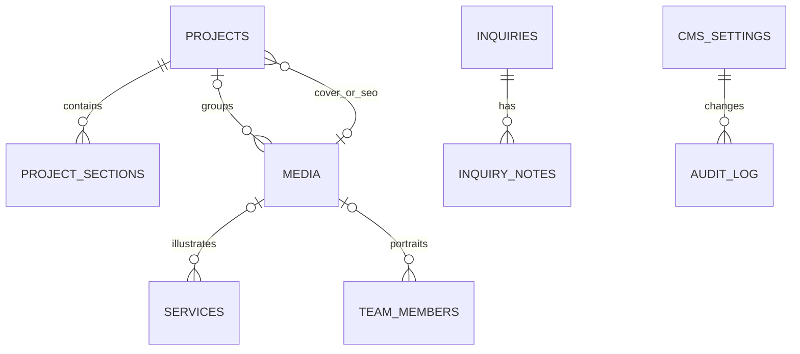

# Modèle de données D1

Le schéma est SQLite/D1. Les relations ci-dessous sont implicites : aucune contrainte de clé étrangère n’est déclarée dans les migrations actuelles.

## Tables

### `cms_settings`

Clé/valeur JSON pour les contenus de page, réglages globaux, SEO et brouillons visuels. Colonnes : `key` PK, `value`, `updated_by`, `created_at`, `updated_at`. Clés usuelles : `home`, `work`, `services_page`, `about`, `contact`, `general`, `seo`, `visual_draft_*`.

### `projects`

Projet éditorial. Colonnes principales : `id` PK, `title`, `people_names`, `slug` unique, `category`, `project_date`, `location`, `excerpt`, `description`, `cover_media_id`, `gallery_json`, `videos_json`, `tags_json`, `seo_title`, `seo_description`, `seo_image_media_id`, `status`, `visible`, `featured`, `display_order`, `deleted_at`, `updated_by`, timestamps.

États observés : `draft`, `published`, `archived`. Un projet public doit être `published`, `visible=1` et non supprimé. `featured` désigne l’histoire mise en avant ; l’API CMS désactive les autres lorsqu’un projet devient vedette.

### `project_sections`

Chapitres d’un projet : `id` PK, `project_id` logique, `section_key`, `title`, `intro`, `media_json`, `videos_json`, `enabled`, `display_order`, timestamps. L’API remplace toutes les sections lors d’un enregistrement de projet.

### `media`

Métadonnées D1 des objets R2 : `id` PK, `name`, `title`, `caption`, `category`, `type`, `mime_type`, `description`, `alt_text`, clés `original/thumbnail/mobile/desktop`, `external_url`, `custom_thumbnail_media_id`, dimensions, durée, taille source, `project_id`, visibilité, suppression logique, auteur et timestamps.

Catégories UI : `photo`, `video`, `logo`, `other`. Types techniques : `image`, `video`, `external_video`. Le contenu binaire n’est pas dans D1.

### `services`

`id`, `name`, `category`, `description`, `image_media_id`, `cta`, `cta_url`, prix, visibilité, ordre, suppression logique, timestamps.

### `team_members`

`id`, prénom, nom, rôle, bio, `photo_media_id`, visibilité, ordre, suppression logique, timestamps.

### `inquiries`

Demandes publiques : identité et contact du client, type/date/lieu d’événement, nombre d’invités, service, source, message, `extra_json`, `status`, `priority`, `follow_up_at`, `handled`, `archived_at`, timestamps.

États applicatifs proposés par le CMS à confirmer dans `admin-app.tsx` : nouveau et états de suivi/traitement/archivage. L’archivage est matérialisé à la fois par le statut et `archived_at`.

### `inquiry_notes`

Notes internes : `id`, `inquiry_id` logique, `note`, `author_email`, `created_at`. L’API actuelle écrit les notes mais la récupération détaillée des notes n’est pas clairement exposée dans la vue Demandes.

### `admin_users`

`email` PK, `role`, `active`, timestamps. Table non utilisée par l’autorisation actuelle, qui dépend de `ADMIN_EMAILS`.

### `audit_log`

Historique : `entity_type`, `entity_id`, `action`, `summary`, `snapshot_json`, `user_email`, date. Sert au tableau de bord, à l’audit et à la restauration visuelle du dernier snapshot publié. Ce n’est pas un système complet de versionnement.

## Relations logiques et intégrité

- `projects.cover_media_id`, `projects.seo_image_media_id` → `media.id`.
- IDs contenus dans les JSON de galerie/vidéo → `media.id`.
- `project_sections.project_id` → `projects.id`.
- `services.image_media_id` et `team_members.photo_media_id` → `media.id`.
- `inquiry_notes.inquiry_id` → `inquiries.id`.
- `media.project_id` → `projects.id` (classement facultatif).

Points à auditer : absence de FK/index sur les colonnes de relation, intégrité des JSON, stratégie de transaction, références orphelines, migration manquante possible pour `updated_by` sur services/équipe, volume de `cms_settings.value` limité par le code de brouillon à 180 000 caractères.

